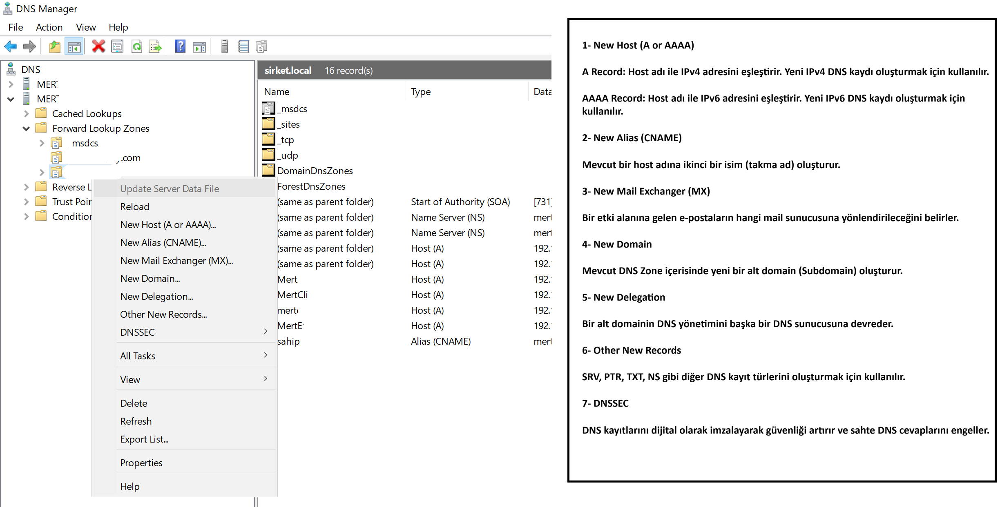

# Forward Lookup Zones

## 📖 Nedir?

Forward Lookup Zone, DNS'in en temel bileşenlerinden biridir. Host (bilgisayar veya sunucu) adlarını IP adreslerine çevirir. Bir istemci bir sunucu adına erişmek istediğinde DNS ilk olarak bu zone'u sorgular.

---

## 🎯 Kullanım Amacı

- Host adlarını IP adreslerine çözümlemek.
- Ağ üzerindeki cihazlara isim kullanarak erişim sağlamak.
- DNS kayıtlarını merkezi olarak yönetmek.

---

## 📌 DNS Kayıt Türleri

### 1. New Host (A or AAAA)

**A Record:** Host adı ile IPv4 adresini eşleştirir. Yeni IPv4 DNS kaydı oluşturmak için kullanılır.

**AAAA Record:** Host adı ile IPv6 adresini eşleştirir. Yeni IPv6 DNS kaydı oluşturmak için kullanılır.

---

### 2. New Alias (CNAME)

Mevcut bir host adına ikinci bir isim (takma ad) oluşturur.

---

### 3. New Mail Exchanger (MX)

Bir etki alanına gelen e-postaların hangi mail sunucusuna yönlendirileceğini belirler.

---

### 4. New Domain

Mevcut DNS Zone içerisinde yeni bir alt domain (Subdomain) oluşturur.

---

### 5. New Delegation

Bir alt domainin DNS yönetimini başka bir DNS sunucusuna devreder.

---

### 6. Other New Records

SRV, PTR, TXT ve NS gibi diğer DNS kayıt türlerini oluşturmak için kullanılır.

---

### 7. DNSSEC

DNS kayıtlarını dijital olarak imzalayarak DNS güvenliğini artırır ve sahte DNS cevaplarını engellemeye yardımcı olur.

---

## 🧪 Lab Çalışması

Bu lab ortamında;

- Forward Lookup Zone incelendi.
- A ve AAAA kayıtları incelendi.
- CNAME kaydı oluşturuldu.
- MX kaydı oluşturuldu.
- Delegation yapısı incelendi.
- DNSSEC menüsü incelendi.

---

## 🖼️ Ekran Görüntüsü

> Forward Lookup Zone menüsü ve DNS kayıt türleri.

